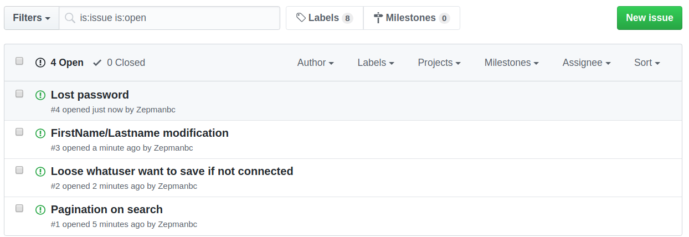

# Améliorez un projet existant en Python

[Tableau Trello](https://trello.com/b/rq2AwW7O/ocdapythonpr11)

[Repo Github](https://github.com/Zepmanbc/oc_dapython_pr11)

[Site en ligne](https://bc-ocdapythonpr11.herokuapp.com/)

[Correspondance avec le client](https://github.com/Zepmanbc/oc_dapython_pr11/blob/master/doc/correspondance.md)

## Création des *issues* sur Github

[https://github.com/Zepmanbc/oc_dapython_pr11/issues](https://github.com/Zepmanbc/oc_dapython_pr11/issues)

---

## [Issue #1](https://github.com/Zepmanbc/oc_dapython_pr11/issues/1) : accumulation des pages lors d'une pagination

Création d'une branche *pagination*

### Ecriture des tests

[*test_search.py*](https://github.com/Zepmanbc/oc_dapython_pr10/blob/master/purbeurre/products/tests/test_search.py)

=> test_pagination_only_one_page

    def test_pagination_only_one_page(loadProducts):
        """Test if page is only one time in url.
        Search the product, go to page 2, go to page 1
        there must be only one `page=1` and not `page=2&page=1`
        """
        response = client.get('/products/search/?query=choucroute&page=2')
        bad_link = '<a href="/products/search/?query=choucroute&amp;page=2&page=1">Précédente</a>'
        good_link = '<a href="/products/search/?query=choucroute&page=1">Précédente</a>'
        assert bad_link not in response.rendered_content
        assert good_link in response.rendered_content

### Modification du code

[*search.html*](https://github.com/Zepmanbc/oc_dapython_pr10/blob/master/purbeurre/products/templates/products/search.html)

code original:

    <a href="{{ request.get_full_path }}&page={{ page_obj.previous_page_number }}">Précédente</a>

code modifié

    <a href="{{ request.path }}?query={{ query }}&page={{ page_obj.previous_page_number }}">Précédente</a>

(Idem pour la page Suivante)

### Mise à jour du test Selenium

[*test_integration.py*](https://github.com/Zepmanbc/oc_dapython_pr11/blob/master/purbeurre/purbeurre/tests/test_integration.py)

    # Go to page 2, got to page 1 and test url
    driver.find_element_by_partial_link_text('Suivante').click()
    driver.find_element_by_partial_link_text('Précédente').click()
    assert re.search(r'/products/search/\?query=choucroute&page=1', driver.current_url)

### Pull request + merge dans le master: mise en production

[https://github.com/Zepmanbc/oc_dapython_pr11/pull/5](https://github.com/Zepmanbc/oc_dapython_pr11/pull/5)

* Vérification de Travis
* Acception du merge: clôture automatique de l'issue #1
* Re vérification de Travis puis mise en production sur Heroku

---

## [Issue #2](https://github.com/Zepmanbc/oc_dapython_pr11/issues/2) : Perte de la sélection si l'utilisateur n'est pas connecté

Création d'une branche *lostsave*

### Ecriture des tests Selenium

Création d'un fichier de test spécifique à l'issue: [*test_integration_issue2.py*](https://github.com/Zepmanbc/oc_dapython_pr11/blob/master/purbeurre/purbeurre/tests/test_integration_issue2.py)

Ecriture de 3 parcours Selenium

* choix produit => choix substitut => connexion => produit sauvegardé
* choix produit => choix substitut => création de compte => produit sauvegardé
* choix produit => choix substitut => page index => connexion => page *Account*

### Modification du code

Création d'une variable en session qui conserve la paire de produits. Si cette variable existe après une connexion ou un enregistrement, redirection vers la page *SaveView* qui récupère la variable en session afin d'enregistrer les produits.

[*product/views.py*](https://github.com/Zepmanbc/oc_dapython_pr11/blob/master/purbeurre/products/views.py)

    request.session['keep_substitute'] = (product_id, substitute_id)

[*authentication/views.py*](https://github.com/Zepmanbc/oc_dapython_pr11/blob/master/purbeurre/authentication/views.py)

Ajout d'un test sur la variable en session sur *AccountView* qui est la cible des pages de connexion et d'enregistrement. Si la variable existe alors il y a redirection vers *products:save*

        if 'keep_substitute' in request.session.keys():
            return redirect('products:save')

[*purbeurre/views.py*](https://github.com/Zepmanbc/oc_dapython_pr11/tree/master/purbeurre/purbeurre/views.py)

Création d'une page *index* pour supprimer la variable en session

### Ecriture des tests

[*authentication/tests/tests_account.py*](https://github.com/Zepmanbc/oc_dapython_pr11/blob/master/purbeurre/authentication/tests/test_account.py) : test_keep_substitute_redirection

[*products/tests/test_save.py*](https://github.com/Zepmanbc/oc_dapython_pr11/blob/master/purbeurre/products/tests/test_save.py) : test_save_after_login

test_save_user_not_logged : ajout de la vérification de création de la variable en session

[*purbeurre/tests/test_purbeurre.py*](https://github.com/Zepmanbc/oc_dapython_pr11/blob/master/purbeurre/purbeurre/tests/test_purbeurre.py) : test_delete_keep_substitute_session

### Pull request + merge dans le master: mise en production

[https://github.com/Zepmanbc/oc_dapython_pr11/pull/6](https://github.com/Zepmanbc/oc_dapython_pr11/pull/6)

* Vérification de Travis
* Acception du merge: clôture automatique de l'issue #2
* Re vérification de Travis puis mise en production sur Heroku

---

## [Issue #3](https://github.com/Zepmanbc/oc_dapython_pr11/issues/3) : Modification nom/prénom

Création d'une branche *namemodif*

### Modification du code

* [*authentication/urls.py*](https://github.com/Zepmanbc/oc_dapython_pr11/blob/master/purbeurre/authentication/urls.py) : ajout du chemin vers la vue *modify*

* [*authentication/views.py*](https://github.com/Zepmanbc/oc_dapython_pr11/blob/master/purbeurre/authentication/views.py) : ajout de *ModifyView*

* [*authentication/templates/authentication/modify.html*](https://github.com/Zepmanbc/oc_dapython_pr11/blob/master/purbeurre/authentication/templates/authentication/modify.html) : création du template pour la vue

* [*authentication/templates/authentication/account.html*](https://github.com/Zepmanbc/oc_dapython_pr11/blob/master/purbeurre/authentication/templates/authentication/account.html) : ajout d'un bouton pour aller vers la page de modification

### Ecriture des tests

[*authentication/tests/test_modify.py*](https://github.com/Zepmanbc/oc_dapython_pr11/blob/master/purbeurre/authentication/tests/test_modify.py) : Test de la modification des données dans la base de donnée et redirection

### mise à jour du test Selenium

[purbeurre/tests/test_integration_issue2.py](https://github.com/Zepmanbc/oc_dapython_pr11/blob/master/purbeurre/purbeurre/tests/test_integration_issue2.py) : parcours de modification des données

### Pull request + merge dans le master: mise en production

[https://github.com/Zepmanbc/oc_dapython_pr11/pull/7](https://github.com/Zepmanbc/oc_dapython_pr11/pull/7)

* Vérification de Travis
* Acception du merge: clôture automatique de l'issue #3
* Re vérification de Travis puis mise en production sur Heroku

---

## [Issue #4](https://github.com/Zepmanbc/oc_dapython_pr11/issues/4) : Réinitialisation du mot de passe

Création d'une branche *resetpassword*

### Modification du code

* [authentication/templates/registration/login.html](https://github.com/Zepmanbc/oc_dapython_pr11/blob/master/purbeurre/authentication/templates/registration/login.html) : ajout du lien vers la réinitialisation de mot de passe.

* Création des différents templates:
    * password_reset_complete.html
    * password_reset_confirm.html
    * password_reset_done.html
    * password_reset_email.html
    * password_reset_form.html
    * password_reset_subject.txt

* [purbeurre/urls.py](https://github.com/Zepmanbc/oc_dapython_pr11/blob/master/purbeurre/purbeurre/urls.py) : modification du chemin pour *authentication* pour coller au générique de Django et ajout de `include('django.contrib.auth.urls')` pour toutes les vues génériques de *password_reset*

* [purbeurre/settings/\_\_init\_\_.py](https://github.com/Zepmanbc/oc_dapython_pr11/blob/master/purbeurre/purbeurre/settings/__init__.py) : ajout de `EMAIL_BACKEND` pour débugger

* [purbeurre/settings/heroku_settings.py](https://github.com/Zepmanbc/oc_dapython_pr11/blob/master/purbeurre/purbeurre/settings/heroku_settings.py) : ajout de la configuration pour utiliser *SendGrid*

### Ecriture de test Selenium

[purbeurre/tests/test_integration_issue4.py](https://github.com/Zepmanbc/oc_dapython_pr11/blob/master/purbeurre/purbeurre/tests/test_integration_issue4.py) : test du parcours de réinitialisation de mot de passe

### Pull request + merge dans le master: mise en production

[https://github.com/Zepmanbc/oc_dapython_pr11/pull/8](https://github.com/Zepmanbc/oc_dapython_pr11/pull/8)

* Vérification de Travis
* Acception du merge: clôture automatique de l'issue #4
* Re vérification de Travis puis mise en production sur Heroku