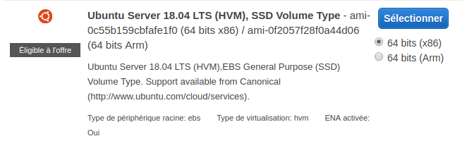
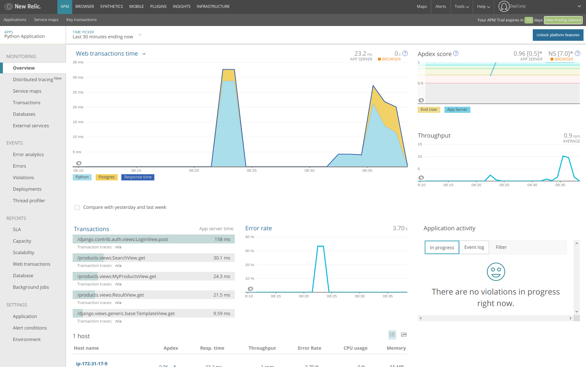

# Déployez votre application sur un serveur comme un pro !

[Application déployée sur AWS](http://18.222.24.163/)

[Tableau Trello](https://trello.com/b/OKalfHad/ocdapythonpr10)

## Déploiement

### Création d'un instance EC2 sur AWS

Modification du "Groupe de sécurité" pour permettre l'entrée en HTTP (port 80)

récupération du fichier *pem*

connection ssh:

    ssh -i "~/.AWS/zepman_air13.pem" ubuntu@ec2-18-222-24-163.us-east-2.compute.amazonaws.com

mise à jour des dépots et installation de python, postgresql, nginx et supervisor

    sudo apt-get update && sudo apt-get upgrade
    sudo apt-get install python3-pip python3-dev libpq-dev postgresql postgresql-contrib
    sudo apt-get install nginx supervisor

copie du repo github

    git clone https://github.com/Zepmanbc/oc_dapython_pr10.git

installation de pipenv et installation des dépendences

    pip3 install pipenv
    cd oc_dapython_pr10/
    pipenv sync --system

### Configuration de postgres

Creation d'un utilisateur et d'une base dans postgres

    sudo -u postgres psql
    CREATE DATABASE purbeurre;
    CREATE USER pb_sql_user WITH PASSWORD '***********';

Modifications pour améliorer la performance des requêtes (cf tuto)

    ALTER ROLE pb_sql_user SET client_encoding TO 'utf8';
    ALTER ROLE pb_sql_user SET default_transaction_isolation TO 'read committed';
    ALTER ROLE pb_sql_user SET timezone TO 'Europe/Paris';

Donne les droits à l'utilisateur sur la base *purbeurre*

    GRANT ALL PRIVILEGES ON DATABASE purbeurre TO pb_sql_user;

Ajout de la configuration dans *settings.py*

    elif get_env_variable('ENV') == 'AWS':
        DATABASES = {
            'default': {
                'ENGINE': 'django.db.backends.postgresql_psycopg2',
                'NAME': get_env_variable('DB_NAME'),
                'USER': get_env_variable('DB_USER'),
                'PASSWORD': get_env_variable('DB_PASSWORD'),
                'HOST': 'localhost',
                'PORT': '5432',
            }
        }

## décomposition du settings.py pour les différents environnements

Création de settings pour:

* [le développement (version de base)]
* [Heroku]
* [AWS]
* [Pytest] 
* [Travis]

### Création des variables d'environnement pour le mot de passe et signifier que l'on est en prod

création d'un fichier *.env*
    ENV=AWS
    DB_NAME=purbeurre
    DB_USER=pb_sql_user
    DB_PASSWORD=***********
    SECRET_KEY=[SECRET_KEY]

### Collecte des fichiers static, migration, collecte de produits

    pipenv run purbeurre/manage.py collectstatic
    pipenv run purbeurre/manage.py migrate
    pipenv run purbeurre/manage.py fillindb 50

### Creation d'un super utilisateur

    pipenv run purbeurre/manage.py createsuperuser

### Configuration de Nginx

ajout de l'adresse du serveur dans les adresses authorisées dans *settings.py*

    if os.environ.get('ENV') in ['PRODUCTION', 'AWS'] :
        DEBUG = False
        ALLOWED_HOSTS = ['bc-ocdapythonpr8.herokuapp.com', '18.222.24.163']

suppression de whitenoise pour servir les fichiers static

    if get_env_variable('ENV') != 'AWS':
        MIDDLEWARE.append('whitenoise.middleware.WhiteNoiseMiddleware')

    (...)

    if get_env_variable('ENV') == 'AWS':
        STATIC_ROOT = os.path.join(BASE_DIR, 'staticfiles')

        # Extra places for collectstatic to find static files.
        STATICFILES_DIRS = (
            os.path.join(BASE_DIR, 'static'),
        )
fichier de configuration Nginx (config/nginx/purbeurre.conf)

    server {

        listen 80;
        server_name 18.222.24.163;
        root /home/ubuntu/oc_dapython_pr10/purbeurre/

        location / {
            proxy_set_header Host $http_host;
            proxy_set_header X-Forwarded-For $proxy_add_x_forwarded_for;
            proxy_redirect off;
            if (!-f $request_filename) {
                proxy_pass http://127.0.0.1:8000;
                break;
            }
        }

        location /static {
            alias /home/ubuntu/oc_dapython_pr10/purbeurre/staticfiles/;
        }
    }

création du lien symbolique vers le fichier de configuration puis rechargement de nginx

    sudo ln -s /home/ubuntu/oc_dapython_pr10/config/nginx/purbeurre.conf /etc/nginx/sites-enabled
    service nginx reload

### Configuration de supervisor

Creation du fichier de [configuration de *supervisor*](https://github.com/Zepmanbc/oc_dapython_pr10/blob/master/config/supervisor/purbeurre-gunicorn.conf)

    [program:purbeurre]
    directory=/home/ubuntu/oc_dapython_pr10/
    command=/home/ubuntu/.local/bin/pipenv run gunicorn --chdir purbeurre purbeurre.wsgi:application
    autostart = true
    autorestart = true
    user=ubuntu

    [supervisord]
    environment=LC_ALL='en_US.UTF-8',LANG='en_US.UTF-8'

* [faire fonctionner pipenv run avec supervisor](https://pipenv.readthedocs.io/en/latest/diagnose/#using-pipenv-run-in-supervisor-program)
* utilisation de `which pipenv` pour connaitre le chemin absolu de *pipenv*
* ajout de environnement dans la config de supervisor

    environment = DJANGO_SETTINGS_MODULE='purbeurre.settings.aws_settings'

creation d'un lien symbolique vers le dossier de configuration

    sudo ln -s /home/ubuntu/oc_dapython_pr10/config/supervisor/purbeurre-gunicorn.conf /etc/supervisor/conf.d/
    sudo supervisorctl reread
    sudo supervisorctl update
    sudo supervisorctl status

## Mise en place de Travis

[*.travis.yml*](https://github.com/Zepmanbc/oc_dapython_pr10/blob/master/.travis.yml)

Et ajout de [coveralls](https://coveralls.io/github/Zepmanbc/oc_dapython_pr10)

## Monitoring

### Mise en place de Newrelic

    pipenv install newrelic

création du fichier de configuration

    pipenv run newrelic-admin generate-config <your-key-goes-here> newrelic.ini

modification de la commande de démarrage dans supervisor

    command = /home/ubuntu/.local/bin/pipenv run newrelic-admin run-program gunicorn --chdir purbeurre purbeurre.wsgi:application
    environment = NEW_RELIC_CONFIG_FILE=/home/ubuntu/oc_dapython_pr10/newrelic.ini

### Mise en place de Sentry

    pipenv install --upgrade sentry-sdk==0.7.11

ajout de la configuration dans *settings/aws_settings.py*

    import sentry_sdk
    from sentry_sdk.integrations.django import DjangoIntegration

    sentry_sdk.init(
        dsn="https://4cc8d88b64444388a3fbbc92cf017305@sentry.io/1445027",
        integrations=[DjangoIntegration()]
    )

Exemple avec une url modifiée

https://sentry.io/share/issue/6e936250d22a4019a08309cadfbe2f17/

Mise en place du loggin sur les recherches des utilisateurs

[*purbeurre/products/views.py*](https://github.com/Zepmanbc/oc_dapython_pr10/blob/master/purbeurre/products/views.py)

    from sentry_sdk import capture_message, configure_scope
    (...)
    class SearchView(ListView):
    (...)
    def get_queryset(self):
        with configure_scope() as scope:
            if '_auth_user_id' in self.request.session._session:
                scope.user = {
                    "email": User.objects.get(pk=self.request.session._session['_auth_user_id']).email
                }
            scope.level = 'info'
            capture_message('New search')

        return Product.objects.filter(
            product_name__icontains=self.request.GET['query']).\
                order_by('product_name')

## Automatisations

Créez une tâche Cron qui mettra à jour les éléments récupérés d’Open Food Facts une fois par semaine.

On va perdre les liens?!

## "Auto-fork" du projet P8

créer un repo sur git (vide)

cloner sur le disque

    git clone git@github.com:Zepmanbc/oc_dapython_pr10.git

aller dans le dossier

    cd oc_dapython_pr10

ajouter le lien avec le repo à forker

    git remote add upstream https://github.com/Zepmanbc/oc_dapython_pr8.git

récupérer les données

    git pull upstream master --allow-unrelated-histories

pousser le tout vers le nouveau repo

    git push origin master 

